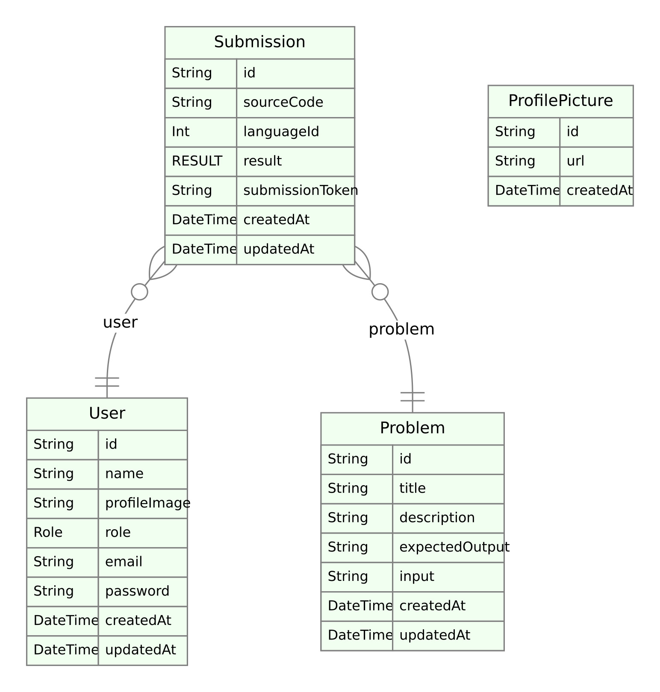

## Problem Statement

Create e a simple application that allows the user to complete/solve programming tests/problems just like LeetCode or Hackerrank.

### Tools

- [Nodejs](https://nodejs.org/en/) is a JavaScript runtime built on Chrome's V8 JavaScript engine.
- [Nestjs](https://nestjs.com/) is a framework for building efficient, scalable Node.js server-side applications. It uses progressive JavaScript, is built with and fully supports TypeScript. Under the hood, Nest makes use of robust HTTP Server frameworks like Express (the default) and optionally can be configured to use Fastify as well!
- [Docker](https://www.docker.com/) is a platform designed to help developers build, share, and run container applications.
- [Docker compose](https://docs.docker.com/compose/) is a tool for defining and running multi-container applications. It simplifies the control of your entire application stack, making it easy to manage services, networks, and volumes in a single, comprehensible YAML configuration file. Then, with a single command, you create and start all the services from your configuration file.
- [Github Actions](https://docs.github.com/en/actions) is a continuous integration and continuous delivery (CI/CD) platform that allows you to automate your build, test, and deployment pipeline right in your repository.

## Entity Relationship Diagram



- Profile picture table does not have a relation with user's because ideally I wanted to name the table `File` and use it to store the url of media files.

## How to Setup Locally

- Ensure you have node, docker and docker compose installed
- Clone the repository using `git clone https://github.com/alahirajeffrey/tvzcorp-technical-test.git` then navigate to the cloned repository.
- Create a .env file and use the variables in the .env.example file as a guide to populate the .env file.
- Run the command `docker compose up -d` to run mysql and start the app in detached mode i.e. it runs in the background.
- Once the application is running, navigate to `localhost:3000/api/v1/doc` to access the swagger file and test the enpoints.

## How to Use

- If you are runnning the app locally, Once the server has been setup, you can upload a profile picture using the `POST /upload/profile-picture` endpoint and pass the url into the request body of the `POST /auth/register` endpoint to create a new account. You can also leave the profile image with an empty string and upload it via the `PATCH /auth/user` endpoint later on.
- If you are using the live version of the app, simply navigate to [here](https://tvzcorp-technical-test.onrender.com/api/v1/doc) to access the live swagger file.
- **NB** You have to register as a DEVELOPER in order to solve the problems and make submissions. Recruiters can register as RECRUITER.
- After registration, you can then login to your account in order to solve problems.
- On the swagger page, navigate to the problems section to see the problems available, create and update problems.
- **NB** Only admins can create and update problems
- In order to solve a problem, you can navigate to the submissions section.
- The available languages to solve a problem and their language IDs can be found [here](https://ce.judge0.com/languages/).
- Here are the language IDs for a few popular langauges: `Javascript : 93`, `Python : 71`, `Golang : 95`, `C++ : 52`

**NB** : The backend on its own cannot cannot handle complex programs as majority of complex programs would have source code that contains non printable characters, or characters which cannot be sent with JSON. Example:

**Sending**

```
console.log("hello world")
```

Would throw an error from the BE as the character `"` cannot be sent over JSON. However

**Using**

```
console.log('hello world')
```

Would not throw an error.

As per judge0, the field would have to be converted to base64 and this can only be done on the FE after which the BE sends converted fields as bas64 to to the judeg0 api.

## How to Run Tests

- To run tests, Open your terminal and navigate to the root directoy of the app.
- Ensure the dependencies are installed and if they are not, install them using `npm install`.
- Then run the command `npm run test` in your terminal to run the unit tests for the services.
- You can also check the result of the automated testing pipeline on the github repo to see results of the test

# Author

[Alahira Jeffrey](<(https://github.com/alahirajeffrey)>)

# Lincense

This project is available for use under the MIT License.
